# YQuantum 2024: DynamicCircuit

This repository is for the 2024 Yale Quantum Hackathon. Our team consists of UCLA students.

Our challenge topic is provided by IBM, a leading company in quantum computing. Our objective was to identify and implement applications using dynamic quantum circuits, which provide advantages over static quantum circuits. Various quantum algorithms, such as quantum algorithm design, circuit compilation, and error correction, can be optimized by leveraging dynamic circuits, where qubits can be measured and read before the next quantum instruction.

</br>
We implemented three key demonstrations:
<br></br>

**1. Repetition Code and five-qubit QEC code under Bitflip/Phaseflip Noise Quantum**

**2. Quantum Remote Dynamic CNOT**

**3. Dynamic Circuit for Remote 2-Qubit Unitary**
<br></br>


All circuit models are designed by inheriting the same classes for user accessibility. Our work not only demonstrates the power of dynamic circuits under various noise conditions but also facilitates future development of Quantum Dynamic Circuits with Qiskit by providing a quantum circuit and error correction package.


# Team: QuBruin

 

**Zhuoyang Ye, Department of Physics and Astronomy, UCLA**

**Qiyu Liu, Department of Physics and Astronomy, UCLA**

**Changsoo Kim, Computer Science Department, UCLA**

**Manvi Agrawal, Department of Physics and Astronomy, UCLA**

**Haocheng wang, Department of Physics and Astronomy, UCLA**


Master's students from the UCLA MQST are currently seeking internships. If you are interested, please feel free to contact us.

[UCLA MQST program webpage](https://qst.ucla.edu/)

# Initialize a virtual environment

You can replicate all our results in this Hackathon on your own computer. Please create a virtual python environment, which we call yalehack, and install the required package 
by running the following commands.


## For Windows users

```console
cd path\to\your\project
py -m venv yalehack
yalehack\Scripts\activate
pip install -r requirements.txt
```

## For Linux/Mac users

```console
cd path/to/your/project
python3 -m venv yalehack
source yalehack/bin/activate
pip install -r requirements.txt
```


# Quantum Error correction

Quantum error correction is essential in developming a scalabale quantum computer. Although there already exists many candidate for the practical QEC code such as torus code, surface code, qldpc code, we lack a software support for understanding, simulating, and compiling different QEC code. The support of dynamic circuit in qiskit promise a bright future of developing all QEC code by qiskit, because all QEC cycle need dynamical instructions such as syndrome measurement and error correction. 

We follow the seperate three stages of developing a unified quantum error corretion package with dynamic circuit:

1. Develop the support of different noise model using qiskit
2. Use stabilizer format to unify the representation of different error correction code.
3. Design the interface carefully and implement the QECCode class, which can be initlized by stabilizer string format.
4. Implement look up table method to do the syndrome decoding.
5. Implement the scalable circuit construction for all syndrome measurement.
6. Implement the scalable circuit construction for all error correction steps.
7. Test the correctness of implementation by add fake noise.
8. Add noise model to the QECcode class
9. Compare the fidelity with and without noise, to demonstrate the effect of QECcode.
10. Inherit the base QECcode class, we impelement the repetition code class and five qubit code class. 


## Noise model  
We have used the following noise models. For more details, please see the [API Documentation](https://docs.quantum.ibm.com/api/qiskit/0.24/qiskit.providers.aer.noise.NoiseModel)
- Bit Flip noise model : Use `construct_bitflip_noise_model(p_reset, p_meas, p_gate1)` to construct a noise model representing bit flip(s).
- Phase Flip noise model : Use `construct_phaseflip_noise_model(p_reset, p_meas, p_gate1)` to construct a noise model representing bit flip(s).
- Depolarizing noise model : Use `construct_depolarizing_noise_model(p_single, p_twoq)` to construct a noise model representing depolarising noise channel.
- Thermal noise model : Use `construct_thermal_noise_model(T1, T2)` to construct a noise model representing thermal errors(s).

> To see things in action, refer to the examples below.


## QECCode class

(Stabilizer, noise simulation, benchmark, error thershold simulation, syndrome table(Decoding) )

Following is the example of how to create a 5 qubit code QEC instance by the stabilizers:

```python
from QEC.QECCode import QECCode

#(5,4,2) means there are 5 physical qubit, 4 stabilizers and the code distance is 2
qec_code=QECCode(5,4,2)
# Initialize the stabilizer
qec_code.set_stabilizers(["XZZXI","IXZZX","XIXZZ","ZXIXZ"])
# Construct the syndrome table for error decoding
qec_code.construct_syndrome_table()
qec_code.show_syndrome_table()
# Construct the syndrome measurement circuit and error correction circuit automatically
qec_code.construct_circuit()
```


## Repetition code

We implement the general repetition quantum error correction code and verify it under different types of quantum noise.

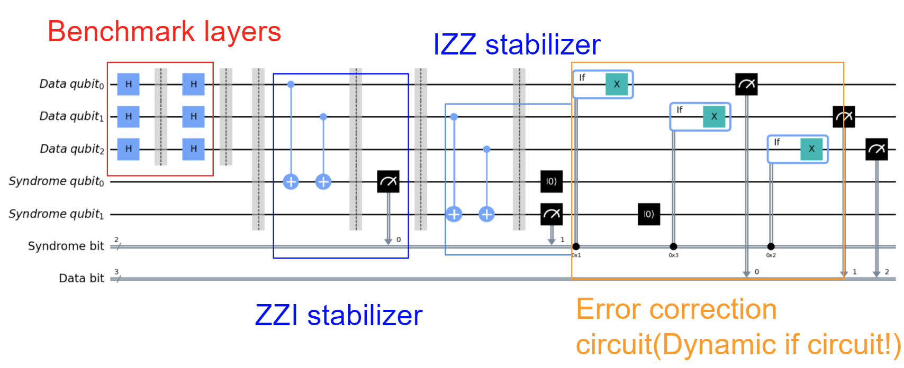 


```python
from QEC.repetition import bitfliprepetitioncode
from Algorithm.noise import construct_bitflip_noise_model

#Initialize a repetiton 
rep=bitfliprepetitioncode(3)
#We can add a noise model to the QECcode class 
noisemodel=construct_bitflip_noise_model(0.01,0.01,0.01)
rep.construct_syndrome_table()
rep.show_syndrome_table()    
rep.add_noise_model(noisemodel)

#Simulate and show the result with and without quantum noise
rep.show_noise_effect(shots=100, save=True,savepath="RepetitionNoise.png")
```

Tthe output of show_syndrome_table() for the above three qubit repetition code is shown as follows:

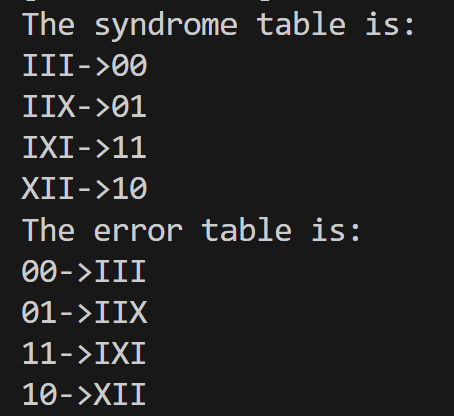 


### Demonstration of repetition code under Bitflip/Phaseflip noise


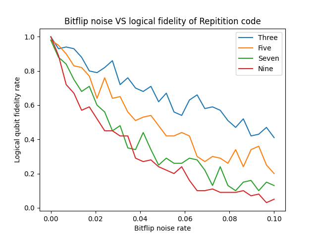 

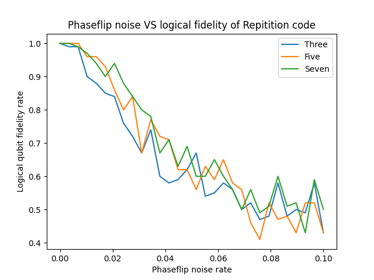 


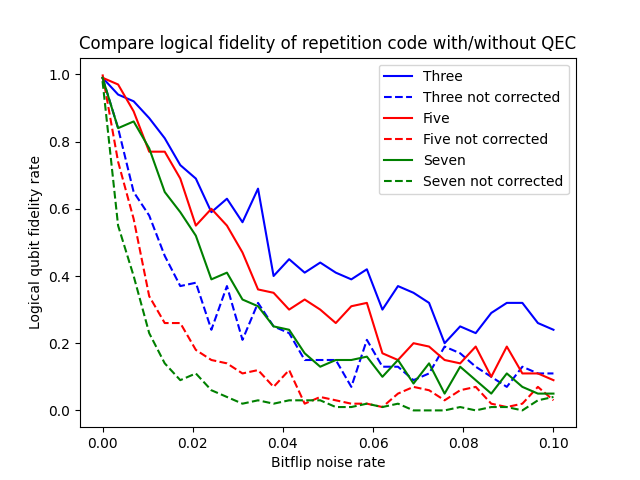 

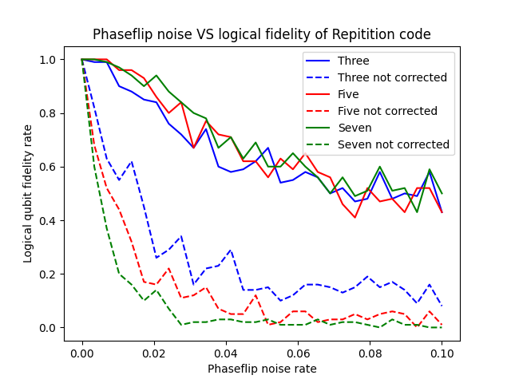 

## Five qubit code

We also implement the five qubit code and compare the performance with five qubit bit repetition code and five qubit phase repetition code.

The encoding circuit of five qubit code is shown as follows:

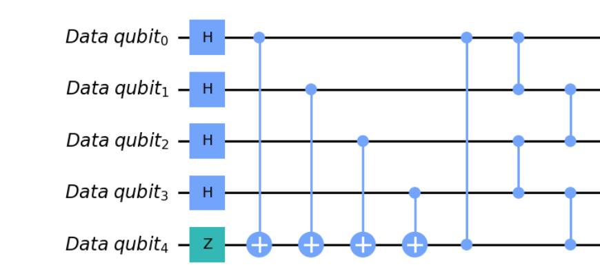 


```python
from QEC.fivequbitcode import fivequbitcode
#Initialize a five qubit code example
fiveqcode=fivequbitcode()
fiveqcode.set_benchmarkwidth(10)
fiveqcode.construct_syndrome_table()
fiveqcode.show_syndrome_table()    
```


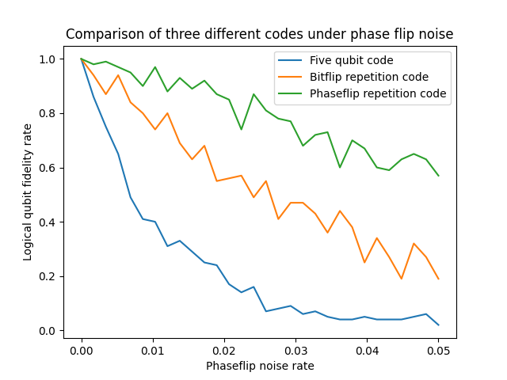 


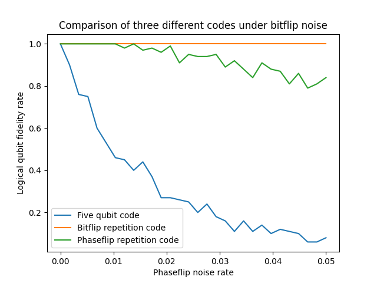 


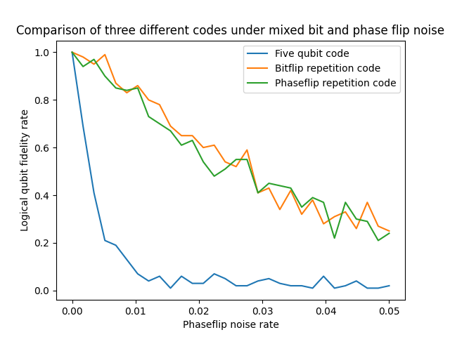 


# Quantum remote dynamic CNOT

We implemented the Remote CNOT gate both dynamically and using traditional unitary gates. The unitary swap gate based CNOT is very common. Here we attach the diagram of dynamic remote CNOT below. 

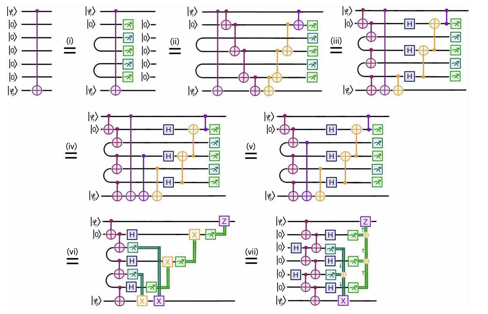 [4, Bäumer, E]

Under different bit flip and phase flip noise model, we observe a better outcome fidelity with dynamically implemented Remote CNOT gate.The comparison is shown below:

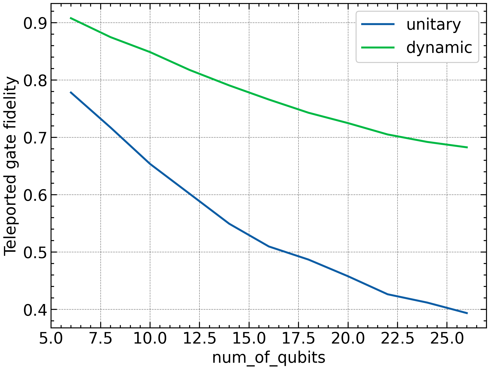 

The command to run the `CNOT.py` file from the working directory
```zsh
python Algorithm/CNOT.py
```
If the user wants to create their own remote gate
```python
cnot = CNOTCircuit(value, 'dynamic_general')
cnot.construct_circuit()
# noise model can be added as
noise = construct_bitflip_noise_model(0.1,0.1,0.1)
cnot.add_noise_model(noise)

# to see the output plot with noise effect
cnot.show_noise_effect(shots = 1000)
```

# Dynamic Circuit for Remote 2-Qubit Unitary
We introduce an algorithm for implementing remote 2-qubit unitary operations using dynamic circuits. Using quantum teleportation, we move states between adjacent qubits with one CNOT gate and one dynamic operation. Our approach reduces the number of CNOT gates by 33% compared to traditional SWAP-based implementation.

## Structure

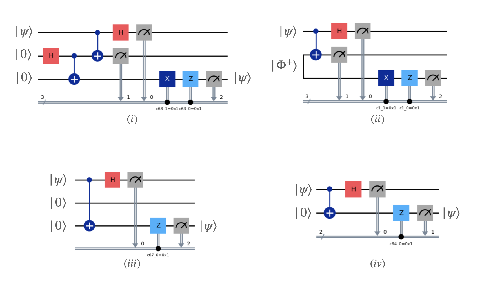 

The circuit for quantum teleportation can be optimized using the `c_if` dynamic operation.

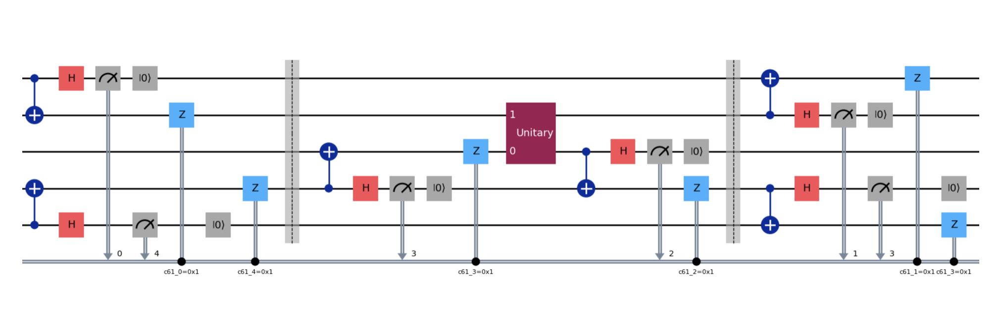 

Using state teleportation, we initially map two states onto adjacent qubits. We then apply a general 2-qubit unitary operation on the adjacent qubits. Finally, we restore the original state's position using the same state teleportation technique.

## Evaluation

(image3)
We achieve equivalent results with a 33% reduction in CNOT gates.

## Examples

```py
from Dynamic_2qUnitary import Dynamic2Q
import numpy as np
from qiskit.quantum_info import random_statevector

# Define the number of qubits
num_qubits = 10

# Generate a random 2-qubit matrix for testing
u_2q = np.random.randn(4, 4)
u_2q, _, _ = np.linalg.svd(u_2q)

# Generate two random states for testing
psi1 = random_statevector(2).data
psi2 = random_statevector(2).data

# Create an instance of the Dynamic2Q circuit
circuit = Dynamic2Q(num_qubits, num_qubits, u_2q, psi1, psi2)

# Run the experiment with 1000 shots
circuit.construct_circuit()
circuit.compute_result(1000)

# Run the experiment with 1000 shots and add noise
circuit.add_noise_model(noise_model)
circuit.show_noise_effect(1000)

# Output
# Accuracy of U (|psi1> |000..0> |psi2>) is:  0.9999179096950854
# Accuracy of noisy U (|psi1> |000..0> |psi2>) is:  0.93779403975291
```


# Reference

[1] A. D. Córcoles, Maika Takita, Ken Inoue, Scott Lekuch, Zlatko K. Minev, Jerry M. Chow, and Jay M. Gambetta Phys. Rev. Lett. 127, 100501

[2] E.Baumer, V.Tripathi, D.S.Wang, P.Rall, E.H.Chen, S.Majumder, A.Seif and Z.K.Minev, Efficient Long-Range Entanglement using Dynamic Circuits, arXiv:2308.13065 [quant-ph].

[3] L. C. G. Govia, P. Jurcevic, S. T. Merkel, and D. C. McKay. 2022. A randomized benchmarking suite for mid-circuit measurements. https://doi.org/10.48550/ARXIV.2207.04836

[4] Bäumer, E., Tripathi, V., Wang, D. S., Rall, P., Chen, E. H., Majumder, S., ... & Minev, Z. K. (2023). Efficient long-range entanglement using dynamic circuits. arXiv preprint arXiv:2308.13065.


